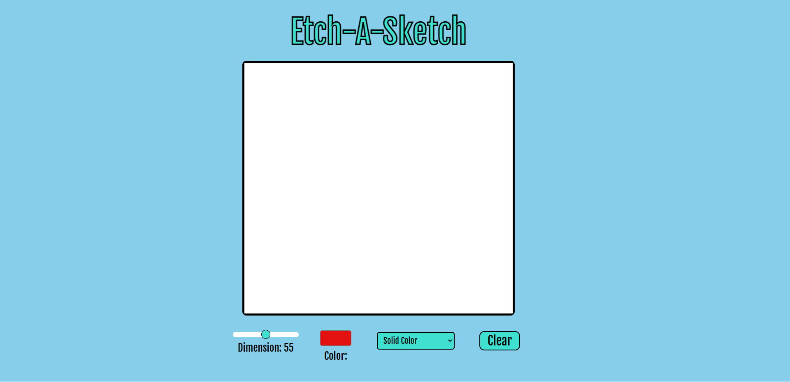

# Etch-A-Sketch
For this project, I designed a functional Etch-A-Sketch/Canvas in the browser. It allows for selecting
the dimensions of the drawing grid from 10x10 to 100x100, selecting the color, choosing whether the
pixels should be solid or should gradually darken in color, and clearing the drawing board. It was designed
using Javascript, HTML, and CSS.

# URL
https://matt-mcauley.github.io/etch-a-sketch

# Author
Matthew McAuley  
mwm223@cornell.edu  
https://github.com/matt-mcauley/etch-a-sketch  